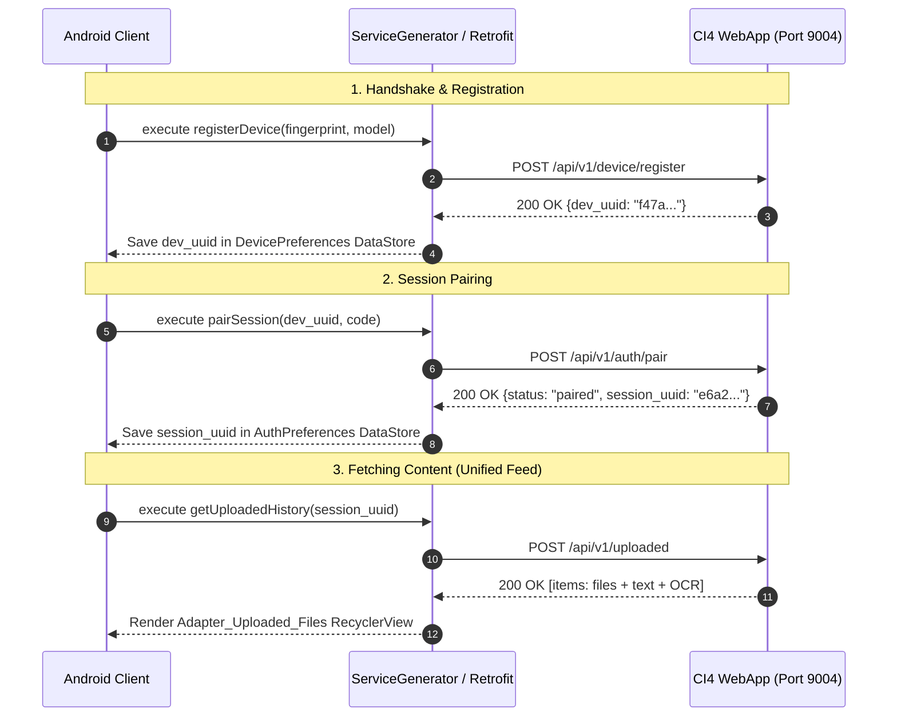

# Client-Server Communication & Networking

This document details the HTTP networking patterns, Retrofit client setup, and request lifecycle between P2P Copier Android App and the CodeIgniter 4 backend relay.

---

## 1. Network Protocol Flow

---

## 2. Retrofit Interface Mapping

Configured in `com.niccher.p2p_copier_app.interfaces.RetrofitInterface`:

| Method | Endpoint | Triggering Component | Purpose |
|---|---|---|---|
| `POST` | `/api/v1/device/register` | `AuthSession.java` | Register device hardware fingerprint |
| `POST` | `/api/v1/auth/pair` | `AuthSession.java` | Validate QR or 6-digit numeric pairing code |
| `POST` | `/api/v1/auth/session-status` | `Fragment_Profile.java` | Check whether current session remains active |
| `POST` | `/api/v1/uploaded` | `Fragment_History_Files.java` | Single merged response of files + texts |
| `POST` | `/api/v1/files/upload` | `Adapter_Sel_Files.java` | Multipart binary file upload |
| `POST` | `/api/v1/files/download` | `Adapter_Uploaded_Files.java` | Download binary payload to device Downloads folder |
| `POST` | `/api/v1/files/delete` | `Adapter_Uploaded_Files.java` | Soft-delete a file record |
| `POST` | `/api/v1/texts` | `TextViewModel.java` | Upload typed text, OCR text, or QR scan data |
| `POST` | `/api/v1/texts/delete` | `Adapter_Uploaded_Files.java` | Soft-delete a text record |
| `POST` | `/api/v1/analytics/summary` | `Fragment_History_Overview.java` | Retrieve transfer statistics & event telemetry |

---

## 3. Base URL & Dynamic Switching

Base URL resolution is managed dynamically via `ServiceGenerator.java` and `Konstants.kt`:
- **Default Base URL**: Set initially via `Konstants.str_base_url`.
- **Runtime Override**: The user or tester can switch host and port at runtime via `BackendConfigActivity`. The updated URL is persisted and reinitializes the OkHttpClient instance with updated connection pools and logging interceptors.
