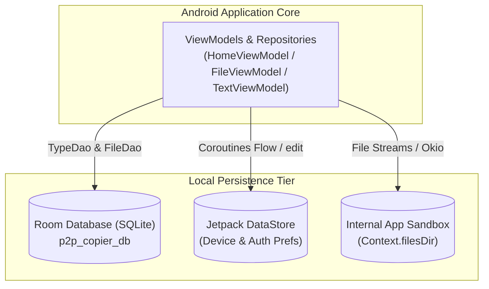
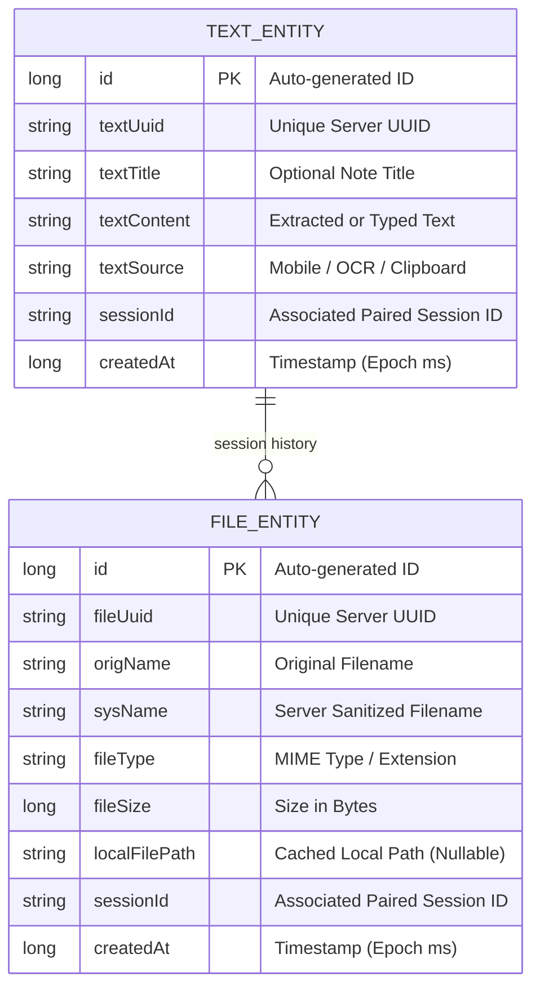

# Data & Local Storage Architecture

This document describes the on-device data persistence layers, database schemas, and preference stores utilized by the **P2P Copier Android App**.

---

## 1. Storage Architecture Overview

The Android mobile client employs a layered persistence strategy:

1. **Room Database (`AppDatabase`)**: Local SQLite persistence for uploaded/received text items and file transfer metadata history.
2. **Jetpack DataStore (`Preferences DataStore`)**: Modern asynchronous key-value storage for device registration UUIDs and paired session credentials.
3. **Internal App Sandbox (`Context.filesDir`)**: Private filesystem storage for cached thumbnails, exported files, and local copies.

---

## 2. Room Database Schema (`p2p_copier_db`)

Database instance: `AppDatabase.kt` (Version `1`).

### Table Definitions:

#### `text_history` Table (`TextEntity.kt`)
- `id` (`Long`, Primary Key, Auto-generate): Local incremental identifier.
- `textUuid` (`String`): UUID assigned by backend relay server or generated client-side.
- `textTitle` (`String?`): Optional title descriptor for typed notes.
- `textContent` (`String`): Raw textual payload (OCR text or manual note).
- `textSource` (`String`): Origin indicator (`"Mobile"`, `"OCR"`, `"Clipboard"`).
- `sessionId` (`String`): Identifier of the active paired session.
- `createdAt` (`Long`): Epoch millisecond timestamp of insertion.

#### `file_history` Table (`FileEntity.kt`)
- `id` (`Long`, Primary Key, Auto-generate): Local incremental identifier.
- `fileUuid` (`String`): Server file UUID for remote retrieval and synchronization.
- `origName` (`String`): Human-readable original filename.
- `sysName` (`String`): Server-side unique storage name.
- `fileType` (`String`): MIME type categorization (e.g. `image/png`, `application/pdf`).
- `fileSize` (`Long`): File size in bytes.
- `localFilePath` (`String?`): Absolute path to cached or downloaded local file.
- `sessionId` (`String`): Associated session UUID.
- `createdAt` (`Long`): Timestamp of transmission or reception.

---

## 3. Jetpack DataStore Preferences

Replaces legacy `SharedPreferences` with transactional, asynchronous Coroutine Flows.

| Preference Store | File / Scope | Key Name | Data Type | Purpose |
|---|---|---|---|---|
| **Device Preferences** | `DevicePreferences.kt` | `KEY_DEVICE_UUID` | `String` | Unique hardware registration UUID assigned by `/api/v1/device/register`. |
| **Device Preferences** | `DevicePreferences.kt` | `KEY_DEVICE_NAME` | `String` | Device model and brand moniker (e.g. `Pixel 7 Pro`). |
| **Auth Preferences** | `AuthPreferences.kt` | `KEY_SESSION_UUID` | `String` | Active paired session UUID authorized for file/text transfers. |
| **Auth Preferences** | `AuthPreferences.kt` | `KEY_BACKEND_URL` | `String` | Configured backend server IP or hostname (default: `http://10.0.2.2:9004/`). |
| **Settings Preferences** | `AuthPreferences.kt` | `KEY_BIOMETRIC_ENABLED` | `Boolean` | Flag controlling whether `BiometricLockActivity` gates app launch. |

---

## 4. Cache & Upload Cleanup Strategy

1. **Transient Picked Files**: When selecting media via `Handle_Files.java`, copies placed in cache are purged upon successful HTTP multipart dispatch.
2. **Session Termination**: When a user selects "Reset Session" in `Fragment_Profile.java`, active session keys in `AuthPreferences` are wiped, and associated records in `text_history` and `file_history` are cleared via `AppDatabase.clearAllTables()`.
