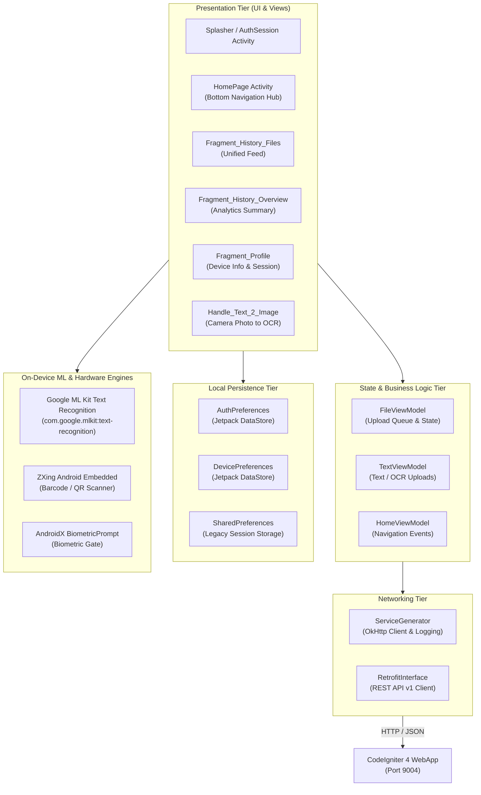

# Client Architecture Overview

This document details the software architecture, component layers, and data flow of the P2P Copier Android client.

---

## 1. High-Level Client Architecture

The application is architected around Android Jetpack patterns (MVVM), incorporating Retrofit for networking, Jetpack DataStore for local session persistence, Google ML Kit for on-device OCR, and ZXing for QR barcode decoding.

---

## 2. Component Responsibility Matrix

| Component Layer | Classes | Responsibility |
|---|---|---|
| **Entry & Gateway** | `Splasher`, `Auth_New_Or_Continue`, `BiometricLockActivity` | Validates biometric lock, checks active session in DataStore, and routes to setup or main hub. |
| **Session & Auth** | `AuthSession.java` | Initiates device registration (`/device/register`) and pairing verification (`/auth/pair`). |
| **Content Handlers** | `Handle_Files.java`, `Handle_Texts.java`, `Handle_Text_2_Image.java` | Pick documents/media, capture typed text from clipboard, and run ML Kit OCR on camera snapshots. |
| **Adapters & UI** | `Adapter_Uploaded_Files.java`, `Adapter_Sel_Files.java` | Renders unified feed cards (color-coded badges for OCR, Text, QR, PDF, Images) and interactive modals. |
| **Networking** | `ServiceGenerator.java`, `RetrofitInterface.java` | Configures OkHttp logging, timeouts, Base URL switching, and REST endpoints. |
| **Local Storage** | `AuthPreferences.kt`, `DevicePreferences.kt` | Asynchronously stores and observes session tokens and device UUIDs via Coroutines Flow. |
